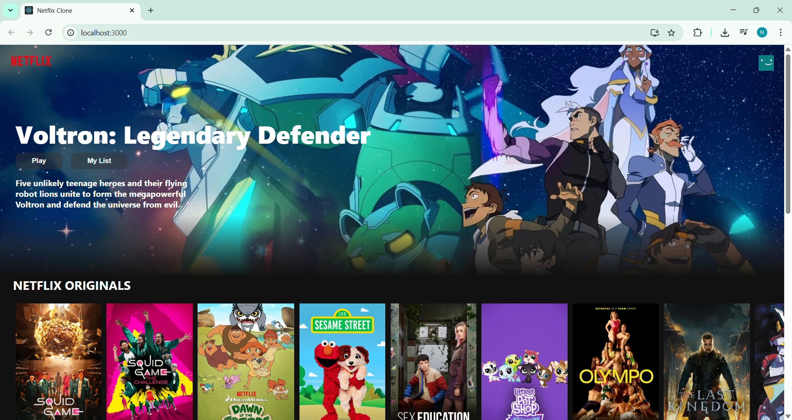

# 🎬 Netflix Clone

A simple Netflix UI clone built with **React.js** and styled using CSS. Movie data is fetched using the **TMDB API**.

---

## 🚀 Features

- Browse trending and top-rated movies
- Play trailers via YouTube
- Scroll-responsive navbar
- Responsive design

---

## 📸 Screenshots



---

## 🛠 Tech Stack

- React.js
- TMDB API
- Axios
- React YouTube
- Movie Trailer

---

## 📦 Setup

```bash
npm install
npm start
```
